# OmniSpace User Flow Diagrams

This document describes the user-facing flows currently implemented in the
OmniSpace frontend and backend. The diagrams use Mermaid and render directly in
GitHub, GitLab, many Markdown editors, and presentation/documentation tools
with Mermaid support.

## Contents

1. [Application entry and role routing](#1-application-entry-and-role-routing)
2. [Registration, login, and session restoration](#2-registration-login-and-session-restoration)
3. [Student flow](#3-student-flow)
4. [Class Representative flow](#4-class-representative-flow)
5. [Faculty flow](#5-faculty-flow)
6. [Resource Manager flow](#6-resource-manager-flow)
7. [Maintenance Staff flow](#7-maintenance-staff-flow)
8. [Admin flow](#8-admin-flow)
9. [Profile and cohort setup](#9-profile-and-cohort-setup)
10. [Personal schedule generation](#10-personal-schedule-generation)
11. [Resource booking](#11-resource-booking)
12. [Classroom booking](#12-classroom-booking)
13. [Booking approval](#13-booking-approval)
14. [Booking status and cancellation](#14-booking-status-and-cancellation)
15. [Routine management](#15-routine-management)
16. [Issue reporting](#16-issue-reporting)
17. [Issue resolution](#17-issue-resolution)
18. [Resource management](#18-resource-management)
19. [Classroom administration](#19-classroom-administration)
20. [Admin user-role management](#20-admin-user-role-management)
21. [Logout](#21-logout)

## Role access summary

| Feature                         | Student |     CR     |     Faculty      |  Resource Manager  | Maintenance Staff | Admin |
| ------------------------------- | :-----: | :--------: | :--------------: | :----------------: | :---------------: | :---: |
| Personal dashboard and schedule |   Yes   |    Yes     |       Yes        |        Yes         |        Yes        |  Yes  |
| Browse rooms and resources      |   Yes   |    Yes     |       Yes        |        Yes         |        Yes        |  Yes  |
| Resource booking                |   Yes   |    Yes     |       Yes        |        Yes         |        No         |  Yes  |
| Classroom booking               |   No    | Own cohort |       Yes        |        Yes         |        No         |  Yes  |
| Booking approval                |   No    |     No     | Department rooms | Managed resources  |        No         |  All  |
| Routine management              |   No    |     No     |   Own routines   |         No         |        No         |  All  |
| Resource catalog management     |   No    |     No     |        No        | Assigned resources |    Status only    |  All  |
| Classroom administration        |   No    |     No     |        No        |         No         |    Status only    |  All  |
| Issue resolution                |   No    |     No     |        No        |         No         |        Yes        |  Yes  |
| User-role management            |   No    |     No     |        No        |         No         |        No         |  Yes  |

## 1. Application entry and role routing

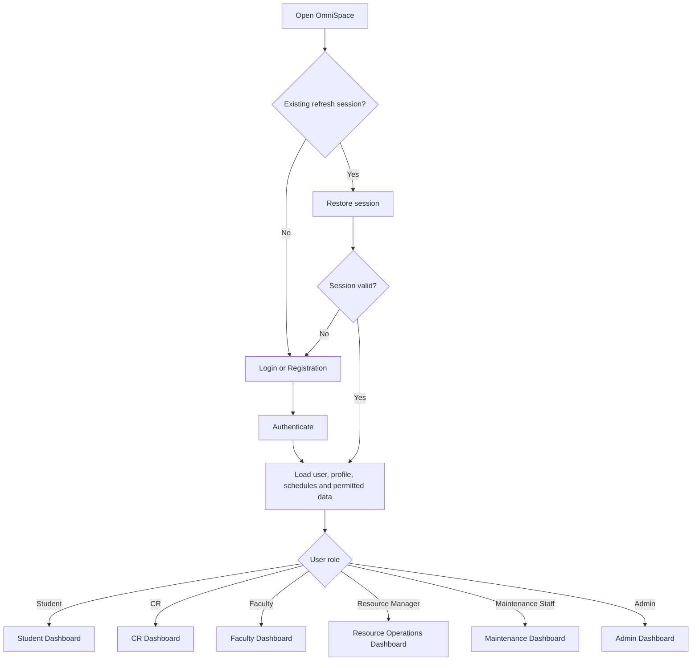
```mermaid
flowchart TD
    A["Open OmniSpace"] --> B{"Existing refresh session?"}
    B -- No --> C["Login or Registration"]
    B -- Yes --> D["Restore session"]
    C --> E["Authenticate"]
    D --> F{"Session valid?"}
    F -- No --> C
    F -- Yes --> G["Load user, profile, schedules and permitted data"]
    E --> G
    G --> H{"User role"}
    H -- Student --> I["Student Dashboard"]
    H -- CR --> J["CR Dashboard"]
    H -- Faculty --> K["Faculty Dashboard"]
    H -- Resource Manager --> L["Resource Operations Dashboard"]
    H -- Maintenance Staff --> M["Maintenance Dashboard"]
    H -- Admin --> N["Admin Dashboard"]
```

## 2. Registration, login, and session restoration

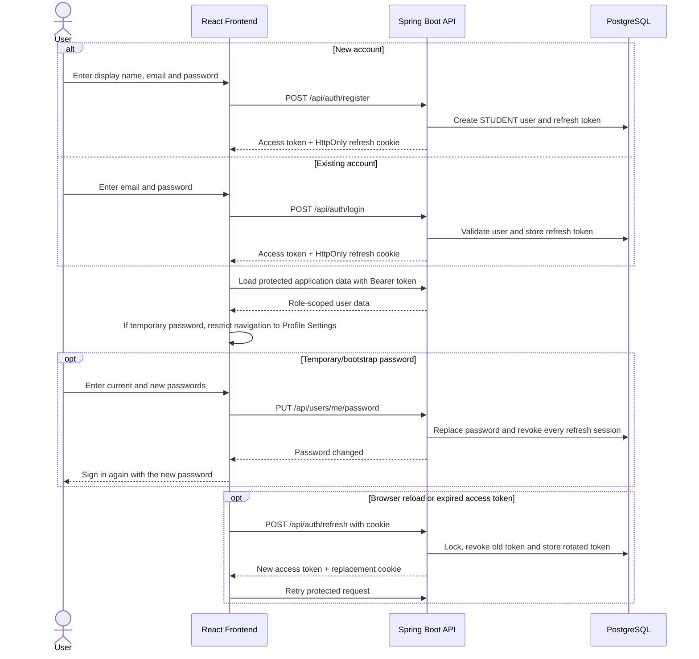
```mermaid
sequenceDiagram
    actor User
    participant UI as React Frontend
    participant API as Spring Boot API
    participant DB as PostgreSQL

    alt New account
        User->>UI: Enter display name, email and password
        UI->>API: POST /api/auth/register
        API->>DB: Create STUDENT user and refresh token
        API-->>UI: Access token + HttpOnly refresh cookie
    else Existing account
        User->>UI: Enter email and password
        UI->>API: POST /api/auth/login
        API->>DB: Validate user and store refresh token
        API-->>UI: Access token + HttpOnly refresh cookie
    end

    UI->>API: Load protected application data with Bearer token
    API-->>UI: Role-scoped user data
    UI->>UI: If temporary password, restrict navigation to Profile Settings

    opt Temporary/bootstrap password
        User->>UI: Enter current and new passwords
        UI->>API: PUT /api/users/me/password
        API->>DB: Replace password and revoke every refresh session
        API-->>UI: Password changed
        UI-->>User: Sign in again with the new password
    end

    opt Browser reload or expired access token
        UI->>API: POST /api/auth/refresh with cookie
        API->>DB: Lock, revoke old token and store rotated token
        API-->>UI: New access token + replacement cookie
        UI->>API: Retry protected request
    end
```

## 3. Student flow

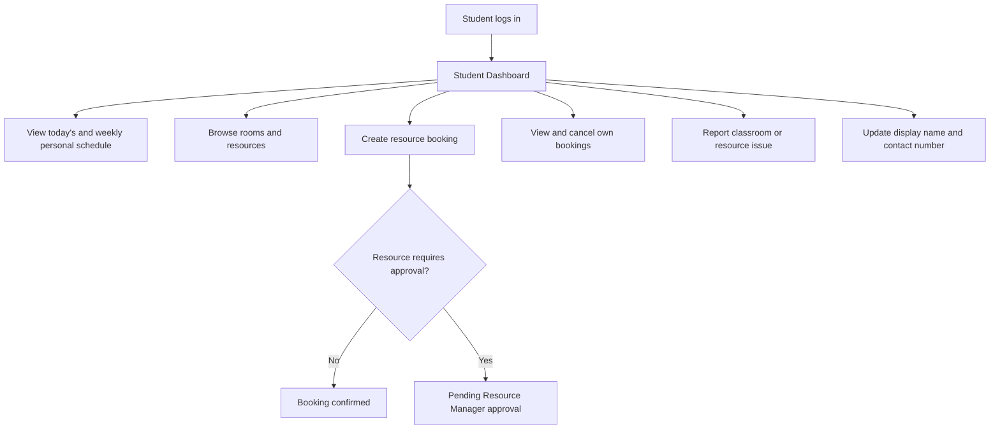
```mermaid
flowchart TD
    A["Student logs in"] --> B["Student Dashboard"]
    B --> C["View today's and weekly personal schedule"]
    B --> D["Browse rooms and resources"]
    B --> E["Create resource booking"]
    B --> F["View and cancel own bookings"]
    B --> G["Report classroom or resource issue"]
    B --> H["Update display name and contact number"]
    E --> I{"Resource requires approval?"}
    I -- No --> J["Booking confirmed"]
    I -- Yes --> K["Pending Resource Manager approval"]
```

## 4. Class Representative flow

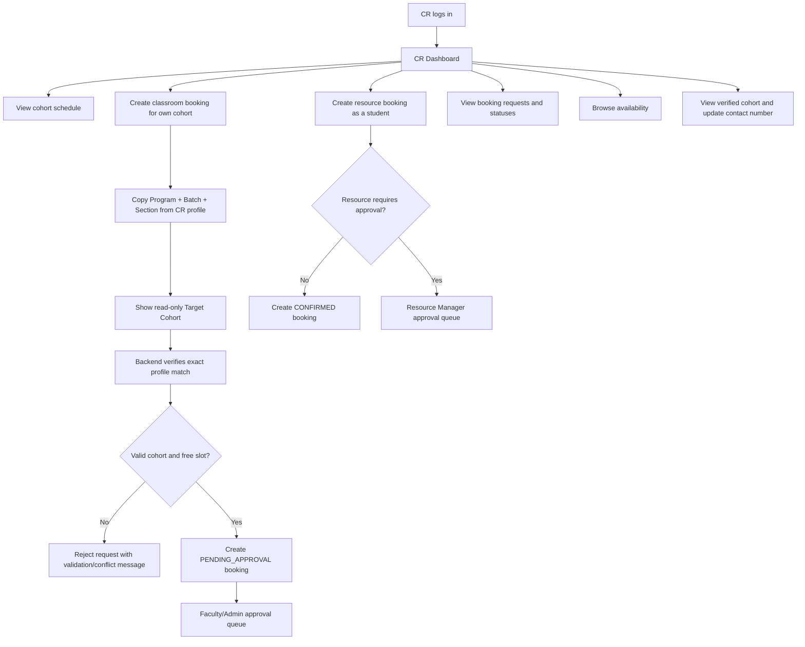
```mermaid
flowchart TD
    A["CR logs in"] --> B["CR Dashboard"]
    B --> C["View cohort schedule"]
    B --> D["Create classroom booking for own cohort"]
    B --> E["Create resource booking as a student"]
    B --> F["View booking requests and statuses"]
    B --> G["Browse availability"]
    B --> H["View verified cohort and update contact number"]
    D --> I["Copy Program + Batch + Section from CR profile"]
    I --> J["Show read-only Target Cohort"]
    J --> K["Backend verifies exact profile match"]
    K --> L{"Valid cohort and free slot?"}
    L -- No --> M["Reject request with validation/conflict message"]
    L -- Yes --> N["Create PENDING_APPROVAL booking"]
    N --> O["Faculty/Admin approval queue"]
    E --> P{"Resource requires approval?"}
    P -- No --> Q["Create CONFIRMED booking"]
    P -- Yes --> R["Resource Manager approval queue"]
```

## 5. Faculty flow

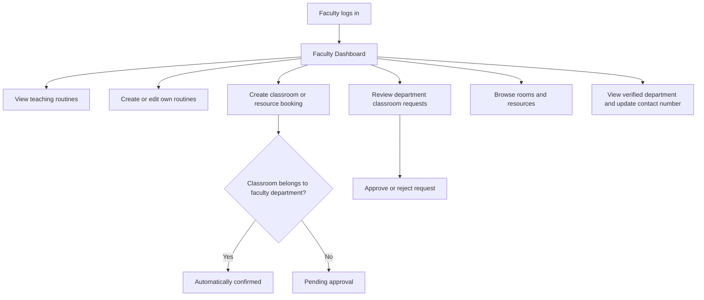
```mermaid
flowchart TD
    A["Faculty logs in"] --> B["Faculty Dashboard"]
    B --> C["View teaching routines"]
    B --> D["Create or edit own routines"]
    B --> E["Create classroom or resource booking"]
    B --> F["Review department classroom requests"]
    B --> G["Browse rooms and resources"]
    B --> H["View verified department and update contact number"]
    E --> I{"Classroom belongs to faculty department?"}
    I -- Yes --> J["Automatically confirmed"]
    I -- No --> K["Pending approval"]
    F --> L["Approve or reject request"]
```

## 6. Resource Manager flow

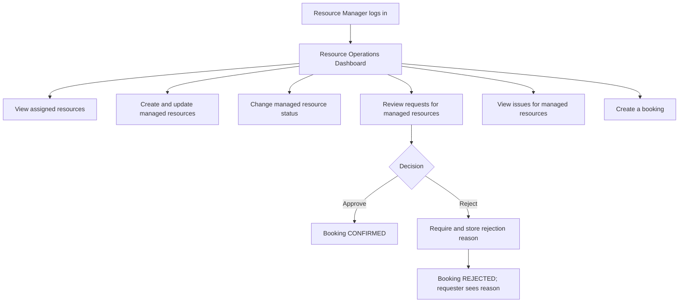
```mermaid
flowchart TD
    A["Resource Manager logs in"] --> B["Resource Operations Dashboard"]
    B --> C["View assigned resources"]
    B --> D["Create and update managed resources"]
    B --> E["Change managed resource status"]
    B --> F["Review requests for managed resources"]
    B --> G["View issues for managed resources"]
    B --> H["Create a booking"]
    F --> I{"Decision"}
    I -- Approve --> J["Booking CONFIRMED"]
    I -- Reject --> K["Require and store rejection reason"]
    K --> K2["Booking REJECTED; requester sees reason"]
```

## 7. Maintenance Staff flow

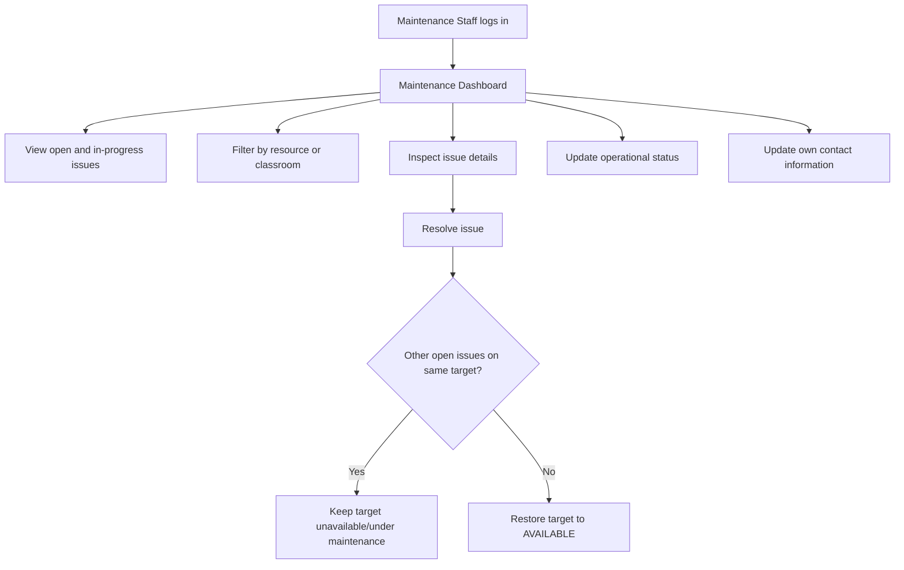
```mermaid
flowchart TD
    A["Maintenance Staff logs in"] --> B["Maintenance Dashboard"]
    B --> C["View open and in-progress issues"]
    B --> D["Filter by resource or classroom"]
    B --> E["Inspect issue details"]
    E --> F["Resolve issue"]
    F --> G{"Other open issues on same target?"}
    G -- Yes --> H["Keep target unavailable/under maintenance"]
    G -- No --> I["Restore target to AVAILABLE"]
    B --> J["Update operational status"]
    B --> K["Update own contact information"]
```

## 8. Admin flow

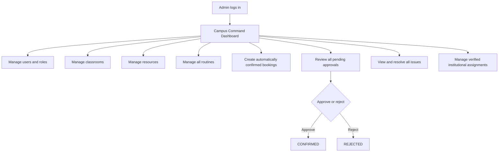
```mermaid
flowchart TD
    A["Admin logs in"] --> B["Campus Command Dashboard"]
    B --> C["Manage users and roles"]
    B --> D["Manage classrooms"]
    B --> E["Manage resources"]
    B --> F["Manage all routines"]
    B --> G["Create automatically confirmed bookings"]
    B --> H["Review all pending approvals"]
    B --> I["View and resolve all issues"]
    B --> J["Manage verified institutional assignments"]
    H --> K{"Approve or reject"}
    K -- Approve --> L["CONFIRMED"]
    K -- Reject --> M["REJECTED"]
```

## 9. Profile and cohort setup

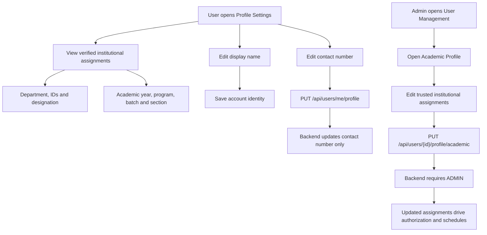
```mermaid
flowchart TD
    A["User opens Profile Settings"] --> B["Edit display name"]
    A --> C["Edit contact number"]
    A --> D["View verified institutional assignments"]
    D --> E["Department, IDs and designation"]
    D --> F["Academic year, program, batch and section"]
    B --> G["Save account identity"]
    C --> H["PUT /api/users/me/profile"]
    H --> I["Backend updates contact number only"]
    J["Admin opens User Management"] --> K["Open Academic Profile"]
    K --> L["Edit trusted institutional assignments"]
    L --> M["PUT /api/users/{id}/profile/academic"]
    M --> N["Backend requires ADMIN"]
    N --> O["Updated assignments drive authorization and schedules"]
```

## 10. Personal schedule generation

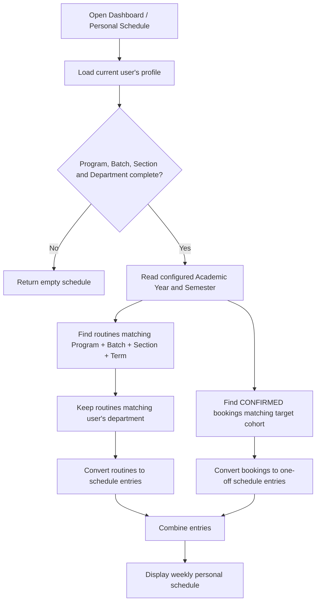
```mermaid
flowchart TD
    A["Open Dashboard / Personal Schedule"] --> B["Load current user's profile"]
    B --> C{"Program, Batch, Section and Department complete?"}
    C -- No --> D["Return empty schedule"]
    C -- Yes --> E["Read configured Academic Year and Semester"]
    E --> F["Find routines matching Program + Batch + Section + Term"]
    F --> G["Keep routines matching user's department"]
    E --> H["Find CONFIRMED bookings matching target cohort"]
    G --> I["Convert routines to schedule entries"]
    H --> J["Convert bookings to one-off schedule entries"]
    I --> K["Combine entries"]
    J --> K
    K --> L["Display weekly personal schedule"]
```

## 11. Resource booking

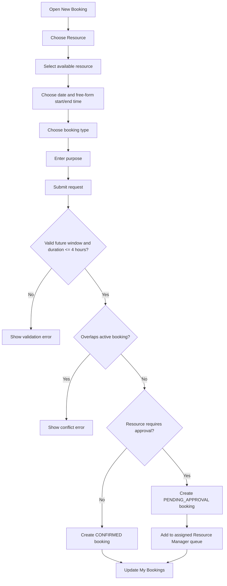
```mermaid
flowchart TD
    A["Open New Booking"] --> B["Choose Resource"]
    B --> C["Select available resource"]
    C --> D["Choose date and free-form start/end time"]
    D --> E["Choose booking type"]
    E --> F["Enter purpose"]
    F --> G["Submit request"]
    G --> H{"Valid future window and duration <= 4 hours?"}
    H -- No --> I["Show validation error"]
    H -- Yes --> J{"Overlaps active booking?"}
    J -- Yes --> K["Show conflict error"]
    J -- No --> L{"Resource requires approval?"}
    L -- No --> M["Create CONFIRMED booking"]
    L -- Yes --> N["Create PENDING_APPROVAL booking"]
    N --> O["Add to assigned Resource Manager queue"]
    M --> P["Update My Bookings"]
    O --> P
```

## 12. Classroom booking

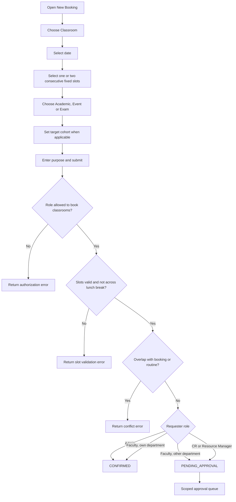
```mermaid
flowchart TD
    A["Open New Booking"] --> B["Choose Classroom"]
    B --> C["Select date"]
    C --> D["Select one or two consecutive fixed slots"]
    D --> E["Choose Academic, Event or Exam"]
    E --> F["Set target cohort when applicable"]
    F --> G["Enter purpose and submit"]
    G --> H{"Role allowed to book classrooms?"}
    H -- No --> I["Return authorization error"]
    H -- Yes --> J{"Slots valid and not across lunch break?"}
    J -- No --> K["Return slot validation error"]
    J -- Yes --> L{"Overlap with booking or routine?"}
    L -- Yes --> M["Return conflict error"]
    L -- No --> N{"Requester role"}
    N -- Admin --> O["CONFIRMED"]
    N -- Faculty, own department --> O
    N -- Faculty, other department --> P["PENDING_APPROVAL"]
    N -- CR or Resource Manager --> P
    P --> Q["Scoped approval queue"]
```

## 13. Booking approval

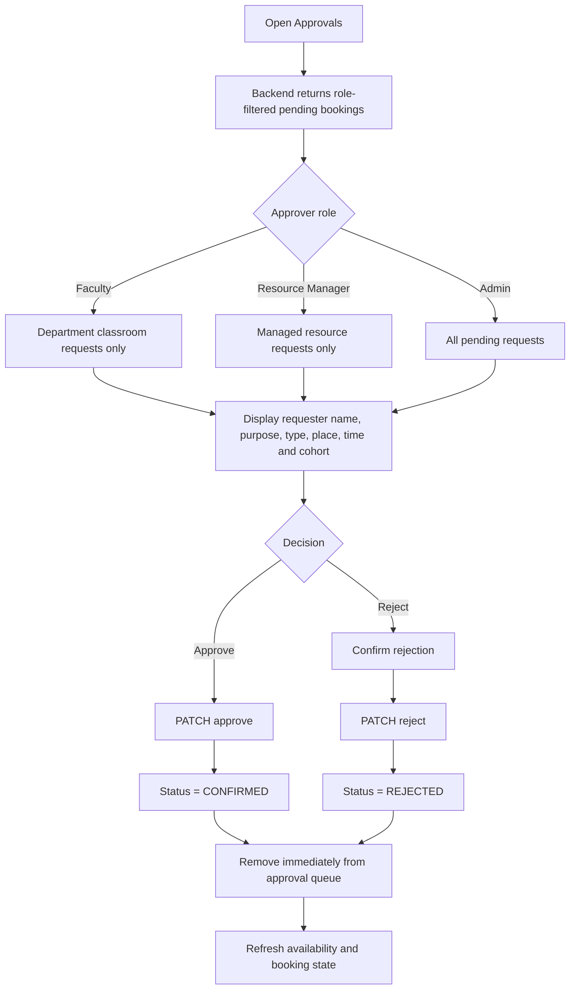
```mermaid
flowchart TD
    A["Open Approvals"] --> B["Backend returns role-filtered pending bookings"]
    B --> C{"Approver role"}
    C -- Faculty --> D["Department classroom requests only"]
    C -- Resource Manager --> E["Managed resource requests only"]
    C -- Admin --> F["All pending requests"]
    D --> G["Display requester name, purpose, type, place, time and cohort"]
    E --> G
    F --> G
    G --> H{"Decision"}
    H -- Approve --> I["PATCH approve"]
    H -- Reject --> J["Confirm rejection"]
    J --> K["PATCH reject"]
    I --> L["Status = CONFIRMED"]
    K --> M["Status = REJECTED"]
    L --> N["Remove immediately from approval queue"]
    M --> N
    N --> O["Refresh availability and booking state"]
```

## 14. Booking status and cancellation

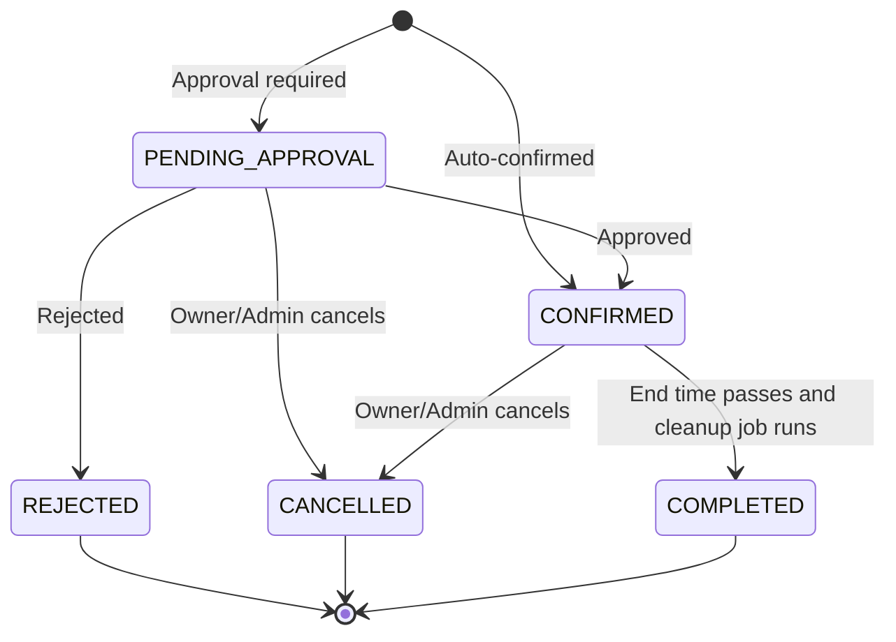
```mermaid
stateDiagram-v2
    [*] --> PENDING_APPROVAL: Approval required
    [*] --> CONFIRMED: Auto-confirmed
    PENDING_APPROVAL --> CONFIRMED: Approved
    PENDING_APPROVAL --> REJECTED: Rejected
    PENDING_APPROVAL --> CANCELLED: Owner/Admin cancels
    CONFIRMED --> CANCELLED: Owner/Admin cancels
    CONFIRMED --> COMPLETED: End time passes and cleanup job runs
    REJECTED --> [*]
    CANCELLED --> [*]
    COMPLETED --> [*]
```

## 15. Routine management

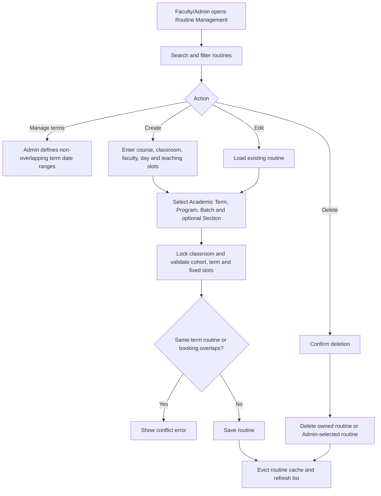
```mermaid
flowchart TD
    A["Faculty/Admin opens Routine Management"] --> B["Search and filter routines"]
    B --> C{"Action"}
    C -- Manage terms --> T["Admin defines non-overlapping term date ranges"]
    C -- Create --> D["Enter course, classroom, faculty, day and teaching slots"]
    C -- Edit --> E["Load existing routine"]
    C -- Delete --> F["Confirm deletion"]
    D --> G["Select Academic Term, Program, Batch and optional Section"]
    E --> G
    G --> H["Lock classroom and validate cohort, term and fixed slots"]
    H --> I{"Same-term routine or booking overlaps?"}
    I -- Yes --> J["Show conflict error"]
    I -- No --> K["Save routine"]
    F --> L["Delete owned routine or Admin-selected routine"]
    K --> M["Evict routine cache and refresh list"]
    L --> M
```

## 15A. Atomic booking validation

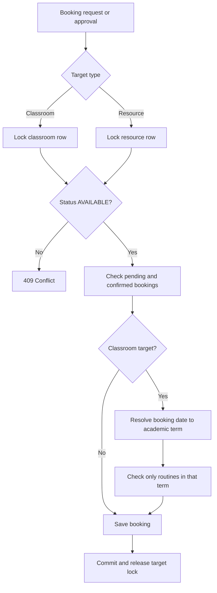
```mermaid
flowchart TD
    A["Booking request or approval"] --> B{"Target type"}
    B -- Classroom --> C["Lock classroom row"]
    B -- Resource --> D["Lock resource row"]
    C --> E{"Status AVAILABLE?"}
    D --> E
    E -- No --> F["409 Conflict"]
    E -- Yes --> G["Check pending and confirmed bookings"]
    G --> H{"Classroom target?"}
    H -- Yes --> I["Resolve booking date to academic term"]
    I --> J["Check only routines in that term"]
    H -- No --> K["Save booking"]
    J --> K
    K --> L["Commit and release target lock"]
```

## 16. Issue reporting

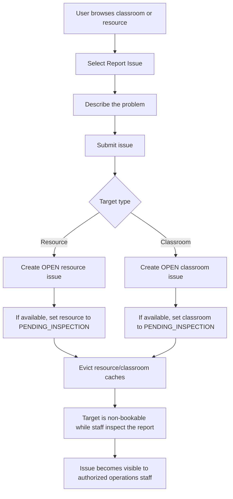
```mermaid
flowchart TD
    A["User browses classroom or resource"] --> B["Select Report Issue"]
    B --> C["Describe the problem"]
    C --> D["Submit issue"]
    D --> E{"Target type"}
    E -- Resource --> F["Create OPEN resource issue"]
    E -- Classroom --> G["Create OPEN classroom issue"]
    F --> H["If available, set resource to PENDING_INSPECTION"]
    G --> I["If available, set classroom to PENDING_INSPECTION"]
    H --> J["Evict resource/classroom caches"]
    I --> J
    J --> K["Target is non-bookable while staff inspect the report"]
    K --> L["Issue becomes visible to authorized operations staff"]
```

## 17. Issue resolution

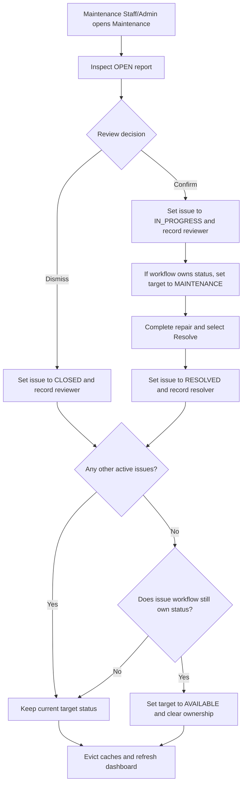
```mermaid
flowchart TD
    A["Maintenance Staff/Admin opens Maintenance"] --> B["Inspect OPEN report"]
    B --> C{"Review decision"}
    C -- Dismiss --> D["Set issue to CLOSED and record reviewer"]
    C -- Confirm --> E["Set issue to IN_PROGRESS and record reviewer"]
    E --> F["If workflow owns status, set target to MAINTENANCE"]
    F --> G["Complete repair and select Resolve"]
    G --> H["Set issue to RESOLVED and record resolver"]
    D --> I{"Any other active issues?"}
    H --> I
    I -- Yes --> J["Keep current target status"]
    I -- No --> K{"Does issue workflow still own status?"}
    K -- No --> J
    K -- Yes --> L["Set target to AVAILABLE and clear ownership"]
    J --> M["Evict caches and refresh dashboard"]
    L --> M
```

## 18. Resource management

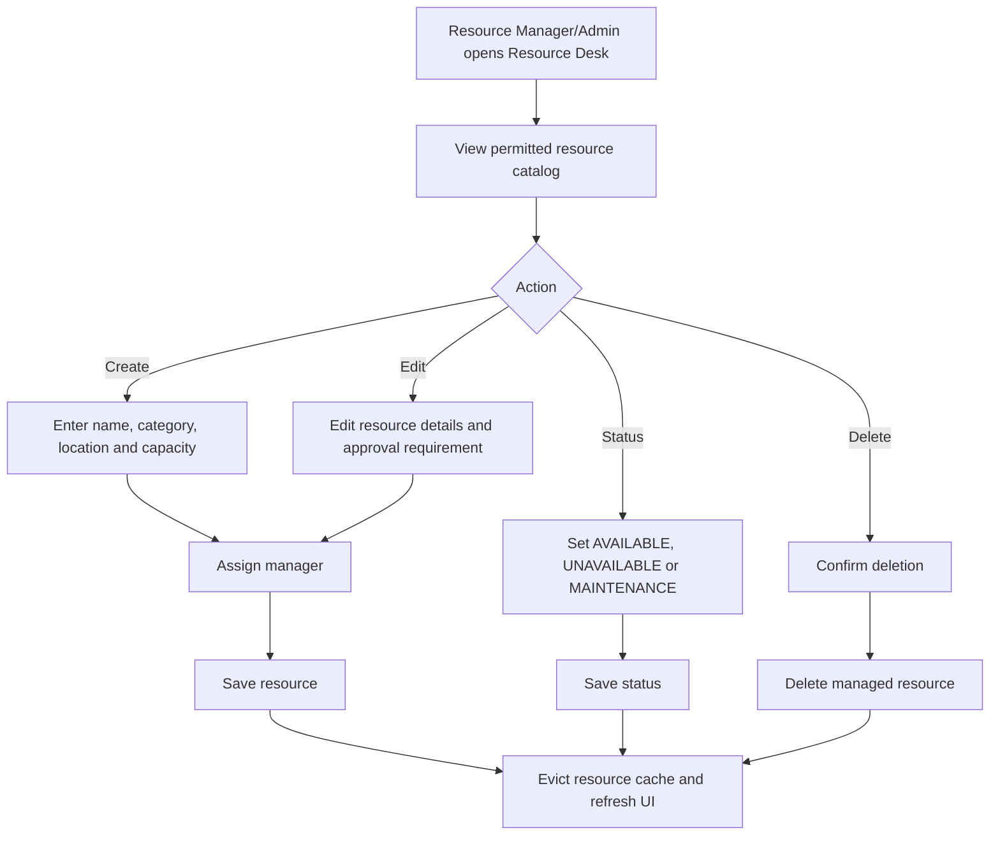
```mermaid
flowchart TD
    A["Resource Manager/Admin opens Resource Desk"] --> B["View permitted resource catalog"]
    B --> C{"Action"}
    C -- Create --> D["Enter name, category, location and capacity"]
    C -- Edit --> E["Edit resource details and approval requirement"]
    C -- Status --> F["Set AVAILABLE, UNAVAILABLE or MAINTENANCE"]
    C -- Delete --> G["Confirm deletion"]
    D --> H["Assign manager"]
    E --> H
    H --> I["Save resource"]
    F --> J["Save status"]
    G --> K["Delete managed resource"]
    I --> L["Evict resource cache and refresh UI"]
    J --> L
    K --> L
```

## 19. Classroom administration

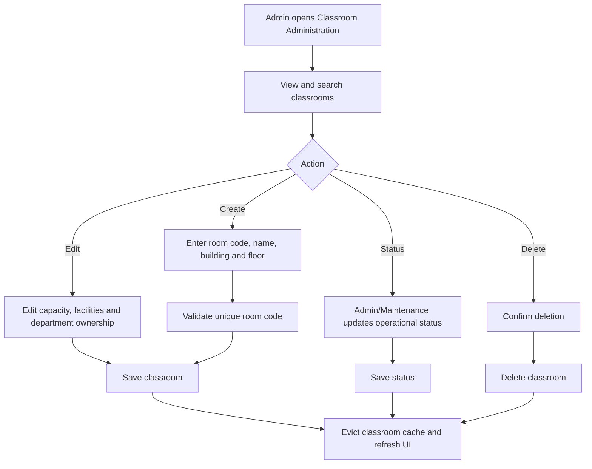
```mermaid
flowchart TD
    A["Admin opens Classroom Administration"] --> B["View and search classrooms"]
    B --> C{"Action"}
    C -- Create --> D["Enter room code, name, building and floor"]
    C -- Edit --> E["Edit capacity, facilities and department ownership"]
    C -- Status --> F["Admin/Maintenance updates operational status"]
    C -- Delete --> G["Confirm deletion"]
    D --> H["Validate unique room code"]
    E --> I["Save classroom"]
    H --> I
    F --> J["Save status"]
    G --> K["Delete classroom"]
    I --> L["Evict classroom cache and refresh UI"]
    J --> L
    K --> L
```

## 20. Admin user-role management

```mermaid
flowchart TD
    A["Admin opens User Roles"] --> B["Load and search users"]
    B --> C["Select a user"]
    C --> D["Open Change Role dialog"]
    D --> E["Choose Student, CR, Faculty, Resource Manager, Maintenance Staff or Admin"]
    E --> F{"Changing own Admin role?"}
    F -- Yes --> G["Reject change"]
    F -- No --> H{"Resource Manager leaving role?"}
    H -- Yes --> I{"Still manages resources?"}
    I -- Yes --> J["Require reassignment first"]
    I -- No --> K["PATCH /api/users/{id}/role"]
    H -- No --> K
    K --> L["Update user role"]
    L --> M["Refresh user table and role badge"]
```

## 21. Logout

```mermaid
sequenceDiagram
    actor User
    participant UI as Frontend
    participant API as Backend
    participant DB as PostgreSQL

    User->>UI: Select Sign Out
    UI->>API: POST /api/auth/logout
    API->>DB: Revoke current refresh token
    API-->>UI: Clear refresh cookie
    UI->>UI: Clear access token and application state
    UI-->>User: Return to Login page
```

## Notes

- Backend permission checks are authoritative. Hiding an action in the
  frontend does not replace server-side authorization.
- Program, batch, and section are currently text values and must match exactly.
- Target cohort values on a booking are stored as a snapshot of the intended
  audience.
- Redis caching affects resource, classroom, and routine reads only; it does
  not cache bookings, approvals, profiles, personal schedules, issues, users,
  or authentication tokens.
